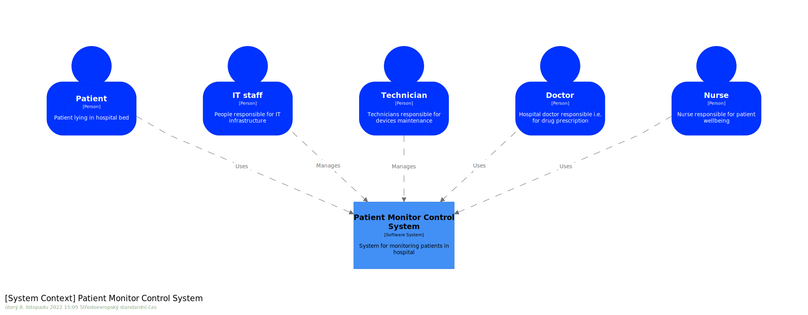
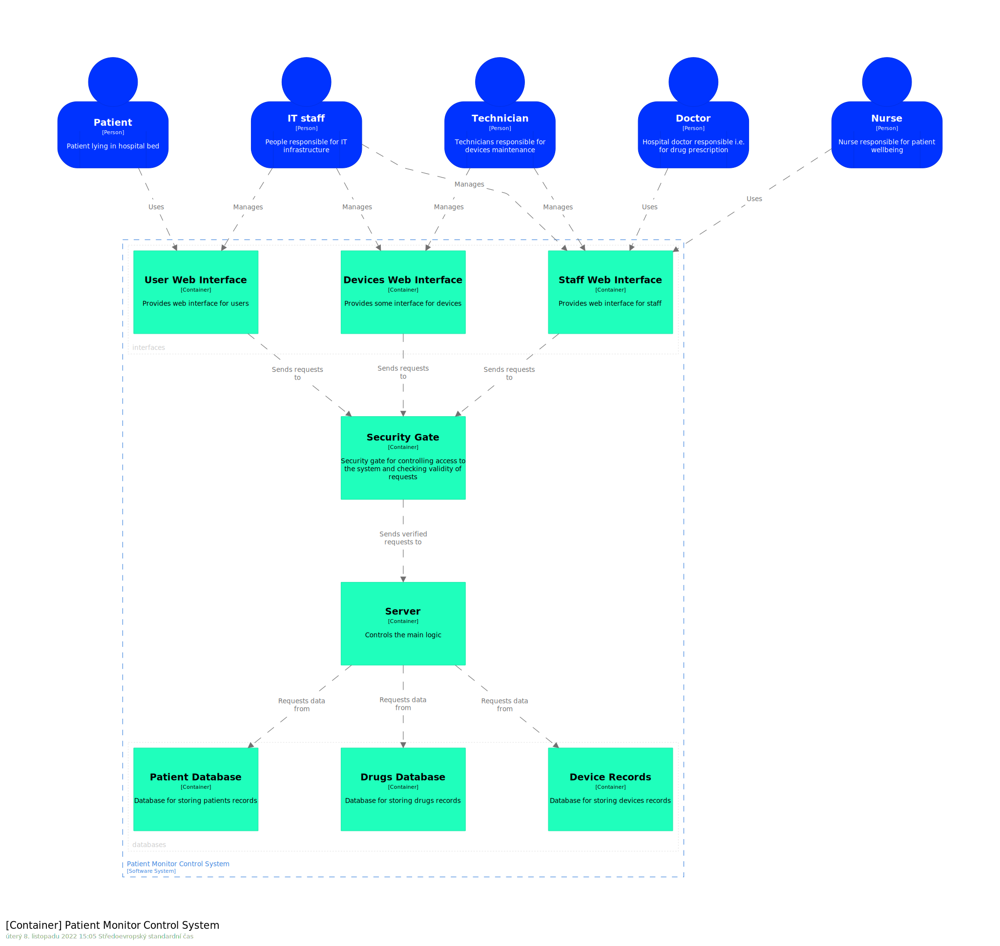
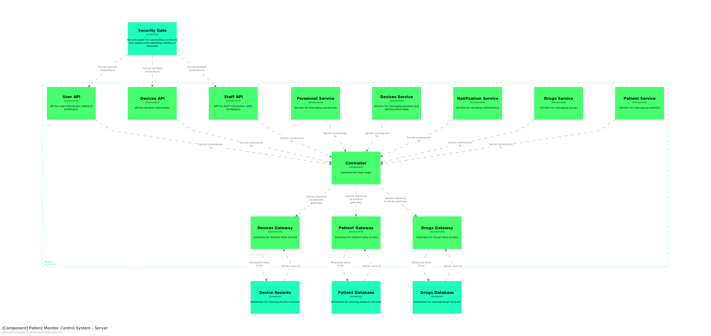

# C4 PMC model
The model is defined in the `workspace.dsl` file.

To see more details about the architecture, please run Structurizr and see the documentation.

Right now, we're using the following architecture:

## Level 1

## Level 2

## Level 3
